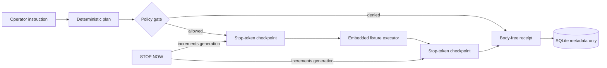

# Switchyard

Switchyard is a local-first operator console built around one promise: an execution route is useful only if it can be inspected, stopped, and accounted for.

The current release is intentionally an **offline proof**, not an assistant with imaginary integrations. It replays one versioned incident fixture through a real policy gate, invalidates in-flight work with generation tokens, and persists audit receipts containing fingerprints instead of operator commands or result bodies.

The interface opens directly on the orbital relay recovery drill. Replay the incident, inspect the returned policy checks and captured evidence, then expand its receipt in the searchable ledger. The stop control remains available while reading the page; reset requires an explicit acknowledgement.

The optional receipt annotation changes the request fingerprint, not the fixture result. A disconnected backend is shown as unconfirmed and cannot admit a replay.

## What is real

| Capability | Status | Evidence |
| --- | --- | --- |
| Deterministic incident replay | Implemented | Versioned JSON fixture and repeatability tests |
| Deny-by-default policy gate | Implemented | Exact capability/risk allowlist and negative tests |
| Stop during execution | Implemented | Generation-token invalidation and async concurrency test |
| Audited stop and reset | Implemented | Separate control routes and receipt rows |
| Body-free receipt ledger | Implemented | Reduced SQLite schema and byte-level privacy test |
| Live web, email, files, repos, or messaging | **Not implemented** | No provider or adapter code ships |
| Voice input or output | **Not implemented** | No browser or server voice claim ships |
| External write actions | **Denied** | No write capability exists in proof mode |

## The route



Every execution and control mutation enters `ActionGateway`. Read-only health, state, and receipt-list endpoints do not create receipts, because doing so would make observation mutate the ledger.

## Run locally

Requirements: Python 3.12+, Node.js 24+, and npm 10+.

```bash
python -m venv .venv
.venv/bin/python -m pip install -r backend/requirements-dev.txt
cd frontend && npm ci && cd ..
```

Start both processes:

```bash
./scripts/dev.sh
```

Open <http://127.0.0.1:5173>. No `.env`, account, token, or network provider is required.

Or use the container profile, which publishes loopback-only ports:

```bash
docker compose up --build
```

Then open <http://127.0.0.1:3000>.

## Verify it

```bash
./scripts/check.sh
```

The check runs the backend suite, Python dependency audit, frontend response-contract tests, typecheck/build/audit, and a high-signal secret scan.

## API surface

| Method | Path | Purpose |
| --- | --- | --- |
| `GET` | `/health` | Liveness and honest runtime mode |
| `GET` | `/api/state` | Stop generation, allowed capabilities, limitations |
| `GET` | `/api/receipts` | Recent metadata-only receipts |
| `POST` | `/api/actions` | Route the embedded fixture through the boundary |
| `POST` | `/api/stop` | Latch stop and invalidate issued tokens |
| `POST` | `/api/stop/reset` | Explicitly acknowledge and reset stop |

The server binds to `127.0.0.1` by default. CORS is an exact, non-credentialed loopback allowlist. These are safeguards, not authentication; read [SECURITY.md](SECURITY.md) before changing the network boundary.

## Project map

- `backend/app/execution.py` — the only execution/control mutation boundary
- `backend/app/policy.py` — compact policy allowlist
- `backend/app/stop.py` — generation-token stop controller
- `backend/app/storage.py` — metadata-only receipt store
- `backend/app/demo_data/` — versioned deterministic evidence
- `frontend/` — responsive React dispatch console
- `ARCH.md` — invariants and extension contract
- `SECURITY.md` — threat model, mitigations, and known risks
- `RUN.md` — operator runbook

Licensed under the [MIT License](LICENSE).
